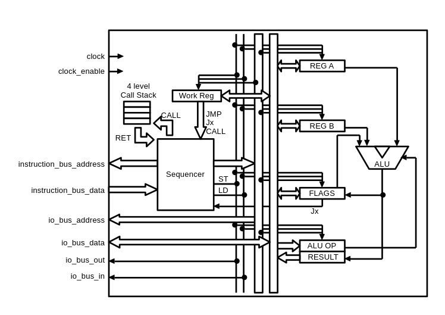

# LD/ST Sequencer
Microsequencer that requires a lot of LOAD/STORE instructions.



## Instructions

|Code         |Instruction|Description                                                           |
|-------------|-----------|----------------------------------------------------------------------|
|0000 rrrrrrrr|LD         | Load reg to work reg                                                 |
|0010 dddddddd|LDI        | Load immideate data to work reg                                      |
|0001 rrrrrrrr|ST         | Store work reg to reg                                                |
|0100 dddddddd|CALL       | Push current address to call stack and jump to (work_reg << 8) + data|
|0101 00000000|RET        | Pop address from call stack and jump to poped address                |
|1001 dddddddd|JZ         | if zero flag=1, jump to (work_reg << 8) + data                       |
|1010 dddddddd|JC         | if carry flag=1, jump to (work_reg << 8) + data                      |
|1100 dddddddd|JO         | if overflow flag=1, jump to (work_reg << 8) + data                   |
|1000 dddddddd|JMP        | Jump to (work_reg << 8) + data                                       |

Note: r=register address, d=(immideate) data


## Registers

|Address      |Name             |Description                                                                                                          |
|-------------|-----------------|---------------------------------------------------------------------------------------------------------------------|
|0            |A                |Register A, used as an argument to be input to ALU. Can be used as a temporary register                              |
|1            |B                |Register B, used as an argument to be input to ALU. Can be used as a temporary register                              |
|2            |FLAGS            |Flags according to the result of ALU execution                                                                       |
|3            |ALU OP/RESULT    |Set the ALU OP code to be executed by the ST instruction; execute the ALU by the LD instruction and return the result|
|4-255        |User defined area||


## ALU

|Op code  |OP  |Description            |O |C |Z |
|---------|----|-----------------------|--|--|--|
|0000 0000|AND |A and B                |R |R |X |
|0000 0100|NAND|A nand B               |R |R |X |
|0010 0000|OR  |A or B                 |R |R |X |
|0010 0100|NOR |A nor B                |R |R |X |
|0100 0000|XOR |A xor B                |R |R |X |
|0100 0100|XNOR|A xnor B               |R |R |X |
|1000 0000|ADD |A + B                  |X |X |X |
|1000 0001|ADC |A + B + carry          |X |X |X |
|1000 0010|SUB |A - B                  |X |X |X |
|1000 0011|SBC |A - B - !carry         |X |X |X |
|1010 0000|SHL |A << 1                 |R |X |X |
|1010 0001|SHCL|A << 1 MSB -> carry    |R |X |X |
|1100 0000|SHR |A >> 1                 |R |X |X |
|1100 0001|SHCR|A >> 1 LSB -> carry    |R |X |X |
|1110 0000|SAR |A >> 1 MSB -> result[7]|R |X |X |

X = set or cleared according to result

R = restored from previously saved value


## Example

- 10 + 5

```
# A <- 10
0010 0000 1010: LD #10
0001 0000 0000: ST A

# B <- 5
0010 0000 0101: LD #5
0001 0000 0001: ST B

# ALU <- ADD
0010 1000 0000: LD #ADD
0001 0000 0011: ST ALU

# work_reg <- A + B
0000 0000 0011: LD ALU
```

